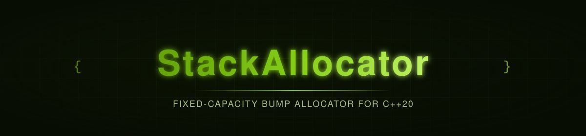

<p align="center">
  
</p>

<p align="center">
  
  
  
</p>

<p align="center">
  
</p>

<p align="center"><sub><b>CI / CD</b></sub></p>
<p align="center">
  <a href="https://github.com/privateMwb/StackAllocator/actions/workflows/build.yml">
    
  </a>
  <a href="https://github.com/privateMwb/StackAllocator/actions/workflows/benchmark.yml">
    
  </a>
  <a href="https://github.com/privateMwb/StackAllocator/actions/workflows/packaging.yml">
    
  </a>
  <a href="https://github.com/privateMwb/StackAllocator/actions/workflows/release.yml">
    
  </a>
</p>

<p align="center"><sub><b>Code Quality &amp; Safety</b></sub></p>
<p align="center">
  <a href="https://github.com/privateMwb/StackAllocator/actions/workflows/coverage.yml">
    
  </a>
  <a href="https://github.com/privateMwb/StackAllocator/actions/workflows/sanitizers.yml">
    
  </a>
  <a href="https://github.com/privateMwb/StackAllocator/actions/workflows/clang-tidy.yml">
    
  </a>
  <a href="https://github.com/privateMwb/StackAllocator/actions/workflows/clang-format.yml">
    
  </a>
  <a href="https://github.com/privateMwb/StackAllocator/actions/workflows/codeql.yml">
    
  </a>
  <a href="https://github.com/privateMwb/StackAllocator/actions/workflows/cflite_pr.yml">
    
  </a>
  <a href="https://www.bestpractices.dev/projects/14743">
    
  </a>
</p>

<p align="center"><sub><b>Documentation</b></sub></p>
<p align="center">
  <a href="https://github.com/privateMwb/StackAllocator/actions/workflows/docs.yml">
    
  </a>
</p>

<p align="center">
  
</p>

<p align="center"><sub><b>Compiler Support</b></sub></p>
<p align="center">
  
  
  
  
</p>

<p align="center">
  
</p>

<p align="center">StackAllocator is a header-only, fixed-capacity, bump-pointer stack allocator for modern C++ — O(1) allocation, marker-based rollback with an RAII <code>StackScope</code>, alignment-aware allocation, and optional zero-cost statistics, so you only pay for the parts you actually use.</p>

<br>

## 📑 Table of Contents

- [Features](#features)
- [Requirements](#requirements)
- [Installation](#installation)
- [Quick Start](#quick-start)
- [Project Structure](#project-structure)
- [Development](#development)
- [Benchmarks](#benchmarks)
- [Fuzzing](#fuzzing)
- [Documentation](#documentation)
- [Contributing](#contributing)
- [Changelog](#changelog)
- [Security](#security)
- [License](#license)

<br>

## <a id="features"></a>✨ Features

- **O(1) bump-pointer allocation** — `allocate()` rounds the current offset up to the requested alignment, bounds-checks it, and bumps it. There is no per-allocation header and no free list. Exhaustion is a plain `nullptr` return — no exceptions, no reallocation — and the bounds check is subtraction-based, so sizes close to `SIZE_MAX` can't overflow it.
- **Marker-based rollback and an RAII `StackScope`** — `getMarker()`/`freeToMarker()` reclaim an entire batch of allocations in O(1), with no fixed nesting-depth limit. `StackScope` captures a marker on construction and restores it on destruction, so rollback is automatic and exception-safe. `reset()` reclaims the whole buffer in O(1).
- **Alignment-aware allocation** — every `Stack` has a per-instance alignment ceiling set at construction, and each `allocate()`/`create()` call may request any power-of-two alignment up to it, over-aligned types included. Alignment is resolved with bit-shift arithmetic rather than a general modulo/division path.
- **Zero-cost optional statistics** — enable them with `Stack<true>` to track total bytes allocated, current and peak usage, and allocation count via `getStats()`. With statistics disabled (the default), the storage is `[[no_unique_address]]` and every update compiles away, so a plain `Stack` carries no bookkeeping at all.
- **In-place object lifecycle** — `create<T>()` allocates storage aligned to `alignof(T)` and constructs a `T` in it; `destroy()` runs `~T()` without reclaiming the storage, which is only returned by `freeToMarker()` or `reset()`. If a constructor throws, the exception propagates and the stack's state stays consistent.
- **Contract-checked, ownership-aware API** — `AP_PRE`/`AP_POST`/`AP_INVARIANT`/`AP_ASSERT` document and enforce preconditions through `assert()` (replaceable globally, and no-ops under `NDEBUG`). `owns()` validates a pointer against a specific allocator instance with a single range check, and a moved-from `Stack` is left empty and reusable.

<div align="right"><a href="#-table-of-contents"></a></div>

## <a id="requirements"></a>📋 Requirements

- A C++20-conformant compiler (tested: GCC, Clang, MSVC, AppleClang)
- CMake 3.20+

<div align="right"><a href="#-table-of-contents"></a></div>

## <a id="installation"></a>📦 Installation

**From source:**

```bash
git clone https://github.com/privateMwb/StackAllocator.git
cd StackAllocator
cmake -B build \
  -DBUILD_TESTS=OFF \
  -DBUILD_BENCHMARKS=OFF \
  -DBUILD_REGRESSION=OFF \
  -DBUILD_EXAMPLES=OFF
cmake --install build
```

Then, in your own `CMakeLists.txt`:

```cmake
find_package(StackPro CONFIG REQUIRED)
target_link_libraries(your_target PRIVATE StackPro::StackPro)
```

> vcpkg and Conan packages are built and verified (recipe in
> `packaging/recipes/stackpro/`, port in `packaging/vcpkg/ports/stackpro/`),
> but not yet published to the public registries. This section will be
> updated once they are.

<div align="right"><a href="#-table-of-contents"></a></div>

## <a id="quick-start"></a>🚀 Quick Start

```cpp
#include <StackPro/Stack.h>

int main() {
    StackPro::Stack<> stack(64 * 1024); // one 64 KiB buffer, allocated up front

    std::byte* bytes = stack.allocate(256); // nullptr if the buffer is exhausted
    int* answer = stack.create<int>(42);    // constructed in place

    if (bytes && answer) {
        // ... use them ...
    }

    stack.destroy(answer); // runs ~int(); the storage stays reserved
    stack.reset();         // reclaim everything in O(1)
}
```

Rolling back with markers and `StackScope`:

```cpp
#include <StackPro/StackScope.h>

StackPro::Stack<> stack(4096);

const auto marker = stack.getMarker();
std::byte* a = stack.allocate(128);
std::byte* b = stack.allocate(256);
stack.freeToMarker(marker); // both blocks reclaimed in O(1)

{
    StackPro::StackScope<> scope(stack);
    std::byte* scratch = stack.allocate(512);
    // ... use scratch ...
} // everything allocated inside the scope is rolled back here
```

Statistics, a custom buffer alignment, and ownership checks:

```cpp
StackPro::Stack<true> stack(1024, /*alignment=*/64);

std::byte* p = stack.allocate(100, /*request_alignment=*/64);

if (p && stack.owns(p)) {
    const auto& stats = stack.getStats();
    std::cout << "used " << stats.currentUsed_ << ", peak " << stats.peakUsed_
              << ", allocations " << stats.allocations_ << '\n';
}

if (!stack.allocate(4096)) {
    std::cerr << "out of capacity\n"; // exhaustion is a nullptr, not an exception
}
```

<div align="right"><a href="#-table-of-contents"></a></div>

## <a id="project-structure"></a>🗂️ Project Structure

```
StackAllocator/
├── include/
│   └── StackPro/
│       ├── Stack.h
│       ├── Stack.tpp
│       ├── StackScope.h
│       └── Contract.h
│
├── tests/
│   ├── custom/
│   ├── google/
│   ├── CMakeLists.txt
│   └── README.md
│
├── benchmarks/
│   ├── baselines/
│   ├── custom/
│   ├── google/
│   ├── results/
│   ├── CMakeLists.txt
│   └── README.md
│
├── examples/
│   ├── support/
│   ├── suite/
│   ├── example_main.cpp
│   ├── CMakeLists.txt
│   └── README.md
│
├── regression/
│   ├── custom/
│   ├── google/
│   ├── results/
│   ├── CMakeLists.txt
│   └── README.md
│
├── fuzz/
│   └── fuzz_stack.cpp
│
├── .clusterfuzzlite/
│   ├── Dockerfile
│   ├── build.sh
│   └── project.yaml
│
├── packaging/
│   ├── README.md
│   ├── requirements.in
│   ├── requirements.txt
│   ├── recipes/
│   ├── vcpkg/
│   └── vcpkg-smoke-test/
│
├── scripts/
│   └── update_package_files.py
│
├── .github/
│   ├── assets/
│   ├── releases/
│   ├── workflows/
│   ├── CODEOWNERS
│   └── dependabot.yml
│
├── cmake/
│   └── StackProConfig.cmake.in
│
├── docs/
│   ├── Doxyfile
│   └── README.md
│
├── .clang-format
├── .clang-tidy
├── .gitignore
├── CMakeLists.txt
├── README.md
├── CONTRIBUTING.md
├── CHANGELOG.md
├── SECURITY.md
├── FUZZING.md
└── LICENSE
```

<div align="right"><a href="#-table-of-contents"></a></div>

## <a id="development"></a>🛠️ Development

The from-source install above builds the library only. To work on
StackAllocator itself — running tests, benchmarks, or the regression tool —
build with everything enabled (the default):

```bash
cmake -B build
cmake --build build
```

**Run the test suite:**

```bash
ctest --test-dir build
```

**Run benchmarks and check for regressions:**

```bash
./build/benchmarks
./build/regression                  # latest baseline vs. benchmarks/results/benchmark_results.json
./build/regression v1.2.0           # a specific baseline vs. current
./build/regression v1.2.0 v1.4.0    # two baselines against each other
```

`regression` picks the latest baseline by semantic version (`v1.10.0`
correctly outranks `v1.9.0`), not alphabetical filename order, and
auto-names its output (`regression_v1.2.0_vs_current.md`/`.json`, etc.).

See [packaging/README.md](packaging/README.md) for notes on verifying the vcpkg
port and Conan recipe locally.

<div align="right"><a href="#-table-of-contents"></a></div>

## <a id="benchmarks"></a>📊 Benchmarks

Measured against `stdStack` (a naive, dynamically-growing baseline), same
build, at 10K / 100K / 1M iterations (`benchmarks/baselines/v1.0.0.json` has
the full dataset).

*Environment: 4-core CI runner @ 3.26 GHz, 32 KiB L1 / 512 KiB L2 / 32 MiB
L3, Release build — see the `context` block in
`benchmarks/baselines/v1.0.0.json` for the exact machine and library
version each run was captured on.*

| Operation | StackPro (1M) | stdStack (1M) | Δ |
|---|---|---|---|
| `Allocate() @ 64 MiB Buffer` | 308.33 us | 17.38 s | +5635372.3% |
| `Allocate() 4096-byte Aligned` | 309.12 us | 11.10 s | +3589567.1% |
| `Allocate() At Capacity (Failure Path)` | 308.35 us | 1.78 s | +578002.8% |
| `Reset() Alone` | 308.34 us | 953.03 us | +209.1% |
| `Reset() + Refill` | 65.48 ms | 128.47 ms | +96.2% |
| `Allocate() Large` | 660.43 us | 1.28 ms | +93.2% |
| `Allocate() Over-aligned` | 753.58 us | 1.29 ms | +70.8% |
| `Create<T>() Trivial Ctor` | 1.31 ms | 1.79 ms | +36.9% |
| `Create<T>() Non-trivial Ctor` | 2.51 ms | 3.37 ms | +33.9% |
| `Destroy<T>() Non-trivial Dtor` | 639.55 us | 647.51 us | +1.2% |
| `Destroy<T>() Trivial Dtor` | 308.33 us | 308.31 us | -0.0% |
| Construction | 29.96 ms | 7.48 ms | -75.0% |

StackPro's fixed-buffer, bump-pointer design pays off most on the
exhaustion path (a bounds check and a `nullptr` return versus `stdStack`
actually reallocating and copying), large or over-aligned allocations, and
bulk churn (`Reset()` + refill) — `stdStack`'s cost scales with buffer size
and requested alignment, while StackPro's stays flat regardless of either,
since it never reallocates.

The trade-off is concentrated in one spot: the buffer is allocated once,
eagerly and aligned, at construction, so `Construction` is consistently
slower than `stdStack`'s lazy setup. `Destroy()` is roughly a wash either
way, since both implementations ultimately just run the same destructor.

<div align="right"><a href="#-table-of-contents"></a></div>

## <a id="fuzzing"></a>🐛 Fuzzing

`Stack` and `StackScope` are continuously fuzzed via
[ClusterFuzzLite](https://google.github.io/clusterfuzzlite/):
model-based testing against an independent shadow model, under
AddressSanitizer and UndefinedBehaviorSanitizer. A short pass runs on
every PR touching `Stack`'s implementation; a longer pass runs
nightly.

This covers capacity boundaries (exact-fit, one-over, and near-`SIZE_MAX`
requests), alignment padding, marker rollback and `StackScope` (including
nested scopes), `reset()`, `create<T>()`/`destroy()`, and move semantics
including self-move. Constructor failure paths (`std::bad_alloc`), a `T`
whose constructor throws inside `create()`, and deliberate contract
violations aren't covered yet — see [FUZZING.md](FUZZING.md) for full
scope, running locally, and reproducing a failing input.

<div align="right"><a href="#-table-of-contents"></a></div>

## <a id="documentation"></a>📖 Documentation

Full API reference, generated with Doxygen from `docs/Doxyfile`:

**https://privateMwb.github.io/StackAllocator/**

<div align="right"><a href="#-table-of-contents"></a></div>

## <a id="contributing"></a>🤝 Contributing

Issues and pull requests are welcome — see [CONTRIBUTING.md](CONTRIBUTING.md)
for the full process, coding standard reference, and what CI checks on
every PR. Short version, before submitting:

- Run the test suite (`ctest --test-dir build`)
- If you're changing a hot path, run `./build/regression` and mention
  the results in your PR description

<div align="right"><a href="#-table-of-contents"></a></div>

## <a id="changelog"></a>📝 Changelog

See [CHANGELOG.md](CHANGELOG.md) for a curated, per-release summary of
changes, or the [Releases](https://github.com/privateMwb/StackAllocator/releases)
page for the full release notes.

<div align="right"><a href="#-table-of-contents"></a></div>

## <a id="security"></a>🔒 Security

See [SECURITY.md](SECURITY.md) for the supported versions, how to report
a vulnerability (including privately, via GitHub Security Advisories),
and the disclosure timeline.

<div align="right"><a href="#-table-of-contents"></a></div>

## <a id="license"></a>📄 License

MIT — see [LICENSE](LICENSE) for details.

<p align="center">
  <sub>Built with C++20</sub>
</p>

<p align="center">
  <a href="#-table-of-contents"></a>
</p>
